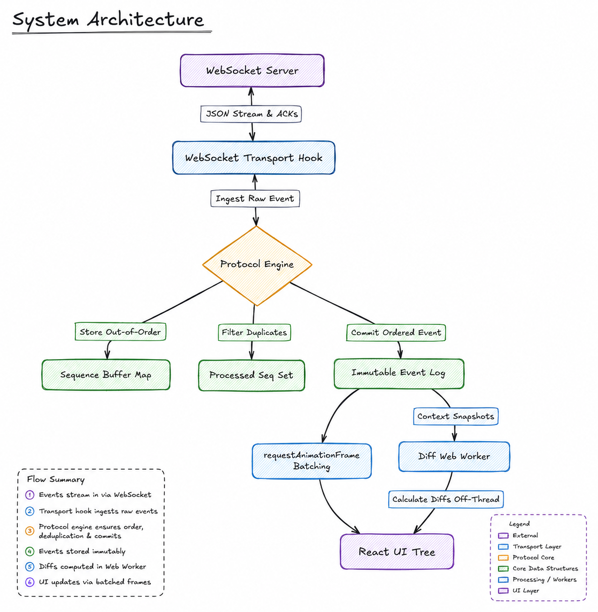

# Full Stack AI Engineer Assignment - Agent Console

**📺 [Watch the Video Demo Here](https://youtu.be/hytPPpKLKEk?si=RFQ_DJsMS2OVOIrB)**

## Deterministic AI Observability Console

A production-grade, event-sourced telemetry dashboard designed to monitor and control a streaming AI agent. The console handles unstable network channels by processing all socket payloads through a deterministic protocol engine, projecting all visual states strictly from an immutable event log.

---

## System Architecture



---

## Directory Structure
*   `/agent-console`: Next.js 14 frontend console (TypeScript, Tailwind CSS).
*   `/agent-server`: Mock AI agent server (TypeScript, tsx runtime).

---

## Core Engineering Highlights

*   **100% Deterministic State Projection**: UI components run the immutable event log chronologically to derive state. The transport layer has no state-modification side effects, guaranteeing zero view drift.
*   **Sequence-Based Reordering**: Buffers out-of-order packets (`seq > expected`) in a hash map and processes them recursively once missing packets arrive, maintaining chronological order.
*   **Deduplication**: Drops duplicate sequence numbers in $O(1)$ time using a tracking set to prevent double-rendering.
*   **Auto-Recovery & RESUME Handshake**: Handles unexpected connection drops by initiating a handshake with the last committed sequence number. The server replays missed packets, and the client filters them against its processed log.
*   **Performance Optimization**: Groups consecutive token updates to prevent browser layout thrashing and reflow bottlenecks.
*   **Trace Focus-Linking**: Maps timeline logs to chat cards, letting users click on any chat message to highlight corresponding execution traces instantly.
*   **Stale Socket Rejection**: Rejects callbacks from stale sockets during hot-reloads by tracking the active socket reference pointer.

---

## Quick Start

### 1. Start the Server (Port `4747`)
```bash
cd agent-server
npm install
npm run build
npm start

# Or with Docker:
docker build -t agent-server .
docker run -p 4747:4747 agent-server --mode chaos
```

### 2. Start the Console (Port `3000`)
```bash
cd agent-console
npm install
npm run dev
```
Visit `http://localhost:3000`.

---

## Technical Design Decisions

### Packet Reordering & Deduplication
To handle unstable channels that shuffle or repeat packets:
*   **O(1) Sequence Buffer**: Out-of-order frames (`seq > expected_seq`) are held in a key-value map.
*   **Linear Commit Loop**: Upon receiving the expected sequence number, the client commits it and recursively checks the buffer for `expected_seq + 1` to resolve gaps.
*   **Double-Render Prevention**: A sequence set tracks all committed sequence numbers. Any packet whose sequence number is already present is immediately discarded.

### RESUME Handshake Recovery
To recover state after connection drops without repeating the entire conversation:
*   The client sends a `RESUME` frame containing the `last_committed_seq`.
*   The server replays only the sequence numbers following that ID.
*   Any overlap is resolved by the client's deduplication set, resuming the live stream seamlessly.

### Layout Reflow Mitigation
High-throughput token streams frequently trigger browser repaint bottlenecking:
*   **Block Partitioning**: Tokens are grouped into static `text` and `tool` block nodes.
*   **State Freezing**: When a tool call starts, the text block reference is frozen to prevent layout shifts.
*   **Append-on-Resume**: Resuming tokens start a new block below the tool card, leaving preceding nodes untouched.

---

## Original Assignment Description

### Overview

In this assignment, you will build an **Agent Console**  a Next.js application that connects to a provided mock AI agent backend over WebSockets, renders streaming responses with mid-stream tool call interruptions, displays a live agent trace timeline, and survives the backend's chaos mode without crashing or losing state.

The backend (`agent-server`) is provided as a Docker container. You do not modify it. It speaks a documented WebSocket protocol, simulates a context-aware AI agent that streams responses, makes tool calls, retrieves context, and  when chaos mode is enabled  drops connections, reorders messages, injects latency spikes, and sends malformed heartbeats. Your job is to build a frontend that handles all of it gracefully.

This is not a chat UI exercise. It is a systems exercise that happens to have a frontend. You will be evaluated on how your application _behaves under stress_, not how it looks in a screenshot.

---

### Protocol Reference

Every WebSocket message is a JSON object with a `type` field and a monotonically increasing `seq` (sequence number). The `seq` is critical  it is how the client tracks what it has received and how state recovery works after reconnection.

#### Client → Server Messages

| Type | Fields | Description |
|---|---|---|
| `USER_MESSAGE` | `content: string` | Send a user message to the agent. |
| `PONG` | `echo: string` | Response to a server PING. Must echo the `challenge` field from the PING, verbatim. |
| `RESUME` | `last_seq: number` | Sent immediately upon reconnection. Tells the server the last `seq` the client successfully processed. The server replays all events after that `seq`. |
| `TOOL_ACK` | `call_id: string` | Acknowledges that the client has rendered a tool call card. The server waits for this before sending `TOOL_RESULT`. |

#### Server → Client Messages

| Type | Fields | Description |
|---|---|---|
| `TOKEN` | `seq`, `text: string`, `stream_id: string` | A chunk of the agent's streaming response. |
| `TOOL_CALL` | `seq`, `call_id: string`, `tool_name: string`, `args: object`, `stream_id: string` | The agent is invoking a tool mid-stream. |
| `TOOL_RESULT` | `seq`, `call_id: string`, `result: object`, `stream_id: string` | The tool returned a result. |
| `CONTEXT_SNAPSHOT` | `seq`, `context_id: string`, `data: object` | A snapshot of the agent's context. |
| `PING` | `seq`, `challenge: string` | Heartbeat. |
| `STREAM_END` | `seq`, `stream_id: string` | Response stream finished. |
| `ERROR` | `seq`, `code: string`, `message: string` | Server error. |

---

## Deliverables

1. **Next.js Application**: Fully buildable and functional.
2. **README.md**: Architectural summary and setup instructions (This file).
3. **Screen Recording**: Chaos mode demonstration.
4. **DECISIONS.md**: Engineering rationale for sequence handling, state recovery, and UI stability.
