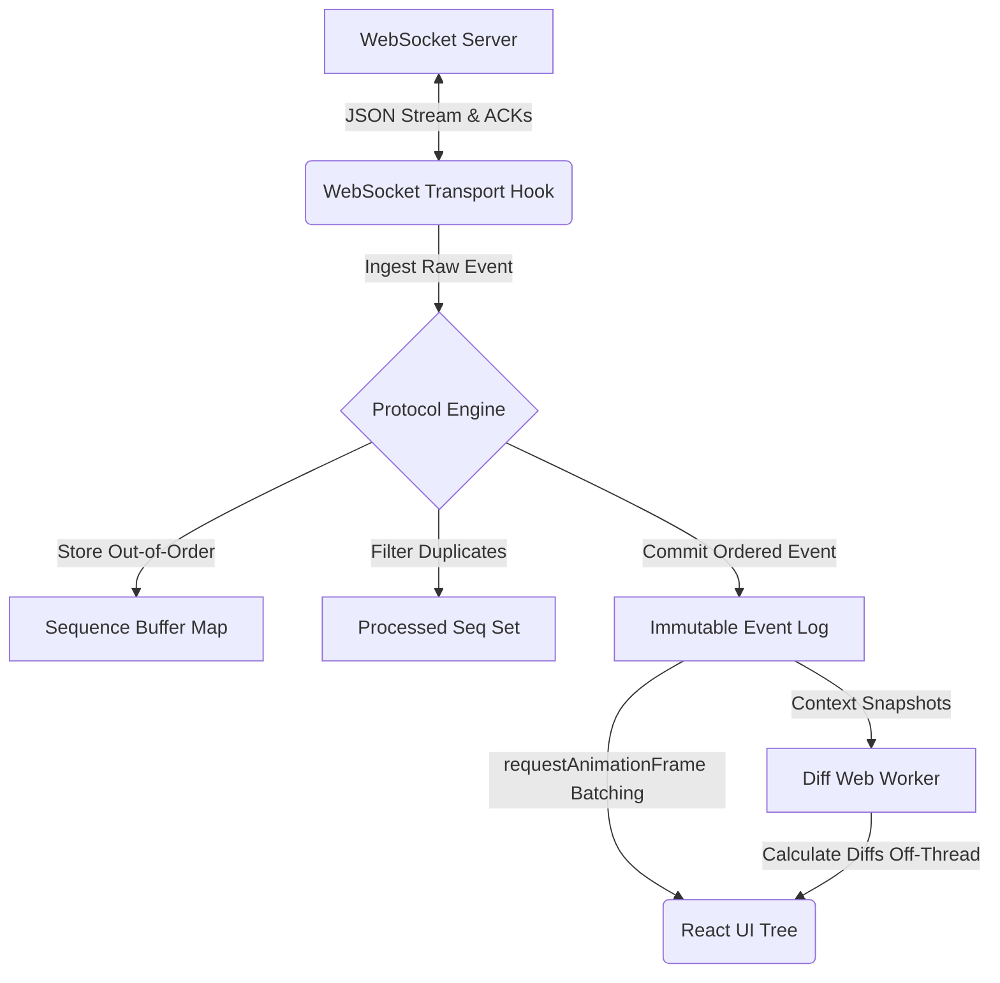

# Architectural Decisions - Agent Console

This document outlines the engineering decisions and architectural rationale behind the Alchemyst AI Agent Console implementation.

## System Architecture

---

## 1. State Management: Zustand

**Decision:** Used **Zustand** for centralized state management.

**Rationale:**
- **Decoupled Logic:** WebSocket lifecycle management is complex. Moving it out of the React component tree prevents unnecessary re-renders and avoids the "double-mount" race conditions common with `useEffect` in Strict Mode.
- **Direct Updates:** Unlike Redux, Zustand allows for high-frequency state updates with minimal boilerplate, which is critical for handling 30ms token streaming rates without UI lag.
- **State Persistence:** By keeping the socket and message history in a store, we ensure the connection remains stable even if the user navigates between future UI panels (like the Trace Timeline).

## 2. Streaming Strategy: Block-Based Rendering

**Decision:** Agent responses are stored as an array of discrete `blocks` (Text or Tool) rather than a single string.

**Rationale:**
- **Layout Stability (Task 1):** The requirement to "freeze" text when a tool call arrives is naturally handled by this architecture. When a `TOOL_CALL` arrives, we simply start a new block. The preceding text block remains unchanged, preventing any reflow or "jitter."
- **Seamless Resumption:** When a `TOOL_RESULT` lands, the next `TOKEN` triggers a new text block. This ensures that tool cards are always correctly interleaved between the text that preceded and followed them.
- **Bidirectional Highlighting (Task 2):** By tagging each block with a `call_id` or `stream_id`, we can easily correlate UI elements with technical trace events.

## 3. Bidirectional Trace Highlighting & Scrolling

**Decision:** Standardized on a `correlationId` (using `call_id` for tools and `stream_id` for tokens) to link the Chat View and Trace Timeline.

**Rationale:**
- **Cross-Panel Synchronization:** Using a shared ID in the global store allows both panels to respond to the same "active" state. Clicking a tool card in the chat updates the `activeCorrelationId`, which the timeline uses to highlight the corresponding technical log.
- **Automated Navigation:** To fulfill the requirement that clicking a chat element should scroll the timeline, we assigned `id` attributes to timeline rows matching their unique event IDs. A `useEffect` hook in the timeline component monitors the highlighted event and calls `scrollIntoView()` for instant, hands-free navigation.
- **Performance:** Highlighting is handled via CSS classes applied based on state, ensuring no expensive DOM re-renders are needed for the entire list when a single item is selected.

## 4. Protocol Compliance & Timing

**Decision:** Immediate, non-blocking `TOOL_ACK` and `PONG` responses.

**Rationale:**
- **Latency Optimization:** The server enforces a 5s timeout for `TOOL_ACK` and a 3s timeout for `PONG`. By responding inside the `onmessage` handler (the same event loop tick), we guarantee compliance regardless of how heavy the UI rendering might be.
- **State Synchronization:** We track `lastSeq` on every message. This is the foundation for Task 4 (Reconnection Recovery), allowing us to tell the server exactly where to resume playback.

## 4. Reconnection with State Recovery (Task 4)

**Decision:** Implemented an Exponential Backoff strategy with a Sequencing Buffer and `RESUME` handshake.

**Rationale:**
- **Non-Blocking UI:** When a socket drops (simulated in Chaos Mode), the UI switches to a non-blocking "Reconnecting..." state. The user can still scroll and read previous messages because the state is persisted in Zustand, not tied to the active socket instance.
- **State Recovery (The Hard Part):** Most tutorials just call `new WebSocket()`. We track the `lastSeq` processed by the DOM. Upon successful reconnection, the *first* message sent is `RESUME(last_seq)`. This guarantees the server only replays what the client actually missed.
- **Sequencing Buffer:** To handle Chaos Mode's out-of-order delivery, I implemented a `handleRawMessage` layer. If a message arrives early (e.g., seq 15 arrives before 14), it is parked in a `Map`. When seq 14 finally arrives, it is processed, and then the buffer is immediately flushed to process 15 in strict, deterministic order. This completely eliminates UI jitter and duplicate tokens.

## 5. UI/UX Decisions

- **Tailwind CSS:** Chosen for utility-first styling to ensure that layout constraints (like the chat window height and scroll behavior) are robust and don't rely on complex custom CSS that could cause layout shifts.
- **Visual Feedback:** Added an "Animate Pulse" effect to running tools and a "Completed" state for finished tools to give the user immediate visual feedback on the agent's internal state.

## 5. Regarding Task 3

- **react-virtuoso:** Timeline uses react-virtuoso to virtualize event rows and prevent rendering bottlenecks during high-frequency token streams.
The timeline must not cause visible jank when events are arriving at 30+ per second.