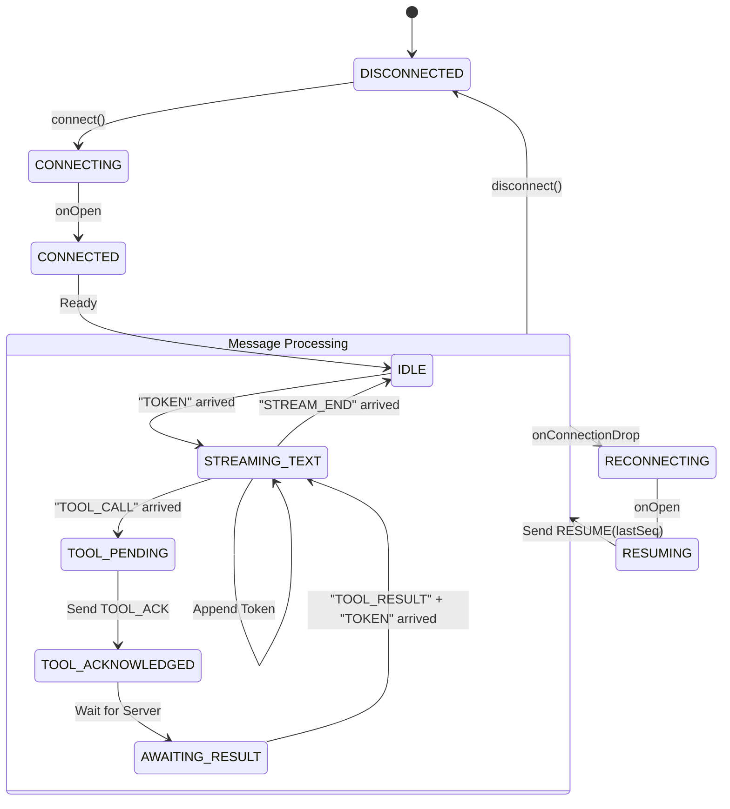

# Agent Console - Design & Setup

## Architectural Approach
The Agent Console is built as a **Distributed Systems Monitoring Tool** rather than a simple chat UI. 
- **State Management**: Zustand handles the persistent WebSocket lifecycle, ensuring the connection is decoupled from React's render cycle.
- **Rendering Strategy**: A "Block-Based" approach ensures zero layout shift. Each agent response is an array of discrete Text or Tool blocks.
- **Protocol Compliance**: Strictly adheres to the `seq` numbering system and mandatory `TOOL_ACK`/`PONG` timing requirements.

## WebSocket State Machine
This diagram shows how we handle the "Hard" part of Task 1: Interleaving streaming tokens with tool calls.



## Setup Instructions

1. **Install Dependencies**:
   ```bash
   npm install
   ```

2. **Run the Backend (Required)**:
   Ensure the `agent-server` is running on port 4747.
   ```bash
   # In agent-server directory
   docker build -t agent-server .
   docker run -p 4747:4747 agent-server
   ```

3. **Run the Frontend**:
   ```bash
   npm run dev
   ```
   Visit `http://localhost:3000`.

## Implementation Status
- [x] **Task 1**: Streaming Chat with Tool Call Interruptions (Complete)
- [ ] **Task 2**: Agent Trace Timeline (Planned)
- [ ] **Task 3**: Context Inspector (Planned)
- [ ] **Task 4**: Reconnection Recovery (Foundation Ready)
- [ ] **Task 5**: Chaos Survival (Testing Phase)
